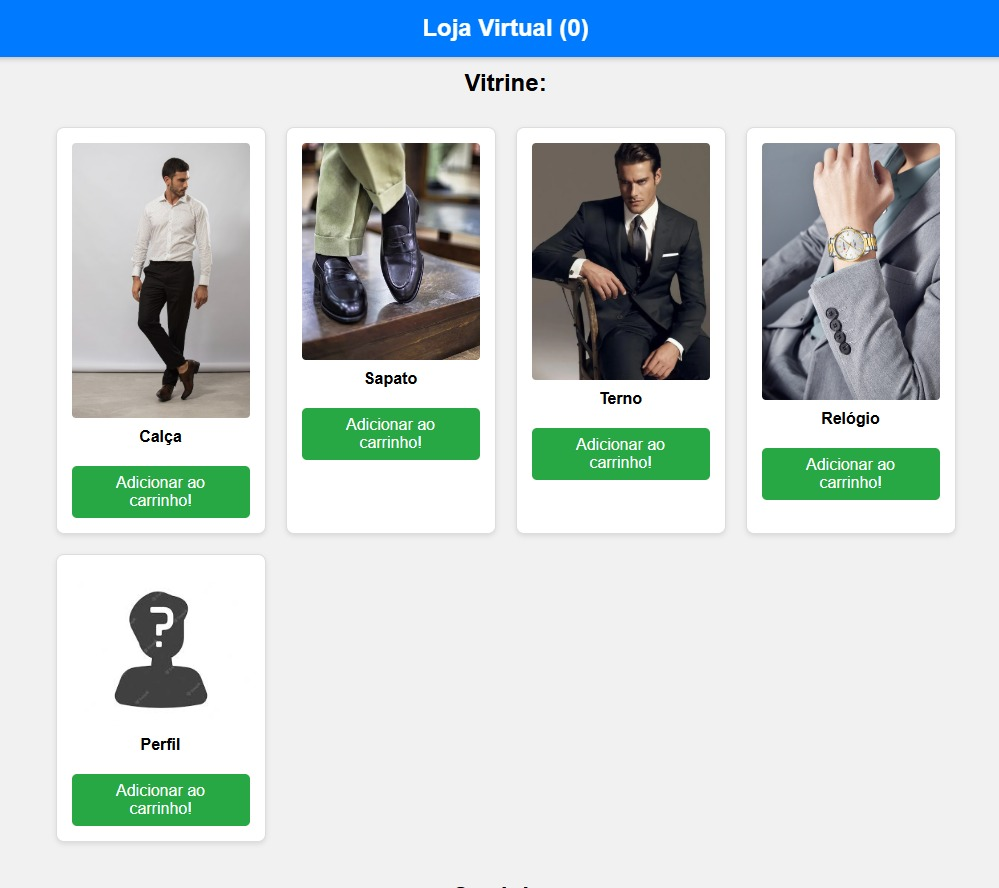

# 🛒 Loja Virtual

Uma simples loja virtual com carrinho de compras desenvolvida com **HTML**, **CSS** e **JavaScript**!

---

## 📸 Preview
<p align="center">
  
</p>

---

## 🚀 Funcionalidades

- Visualização de produtos em formato de vitrine responsiva 🛍️
- Adicionar itens ao carrinho com atualização dinâmica 🔄
- Contador de itens exibido no carrinho 🔢
- Design moderno com layout responsivo 📱

---

## 🛠️ Tecnologias Utilizadas

- **HTML5**
- **CSS3**
- **JavaScript (Vanilla)**

---

## 📂 Estrutura de Pastas

```
store/
├── imagens/
│   ├── calca.jpg
│   ├── carrocel-1.png
│   ├── carrocel-2.png
│   ├── carrocel-3.png
│   ├── image.jpg
│   ├── perfil.jpg
│   ├── relogio.jpg
│   ├── sapato.jpg
│   └── terno.jpg
├── index.html
└── README.md
```

---

## ⚙️ Como Executar

1. Clone o repositório:
```bash
git clone https://github.com/FranALSilva/store.git
```

2. Navegue até a pasta do projeto:
```bash
cd store
```

3. Abra o arquivo `index.html` no seu navegador.

---

## 📌 Próximas Melhorias

- [ ] Implementar botão **Finalizar Compra** com cálculo de valor total
- [ ] Persistir itens do carrinho com **LocalStorage**
- [ ] Melhorar responsividade para diferentes tamanhos de tela
- [ ] Adicionar sistema de login/autenticação

---

## 🤝 Contribuição

Fique à vontade para abrir issues e pull requests!

---

## 📄 Licença

Este projeto está sob a licença [MIT](LICENSE).

---

## 👨‍💻 Autor

Desenvolvido por [Fran AL Silva](https://github.com/FranALSilva) 🚀
